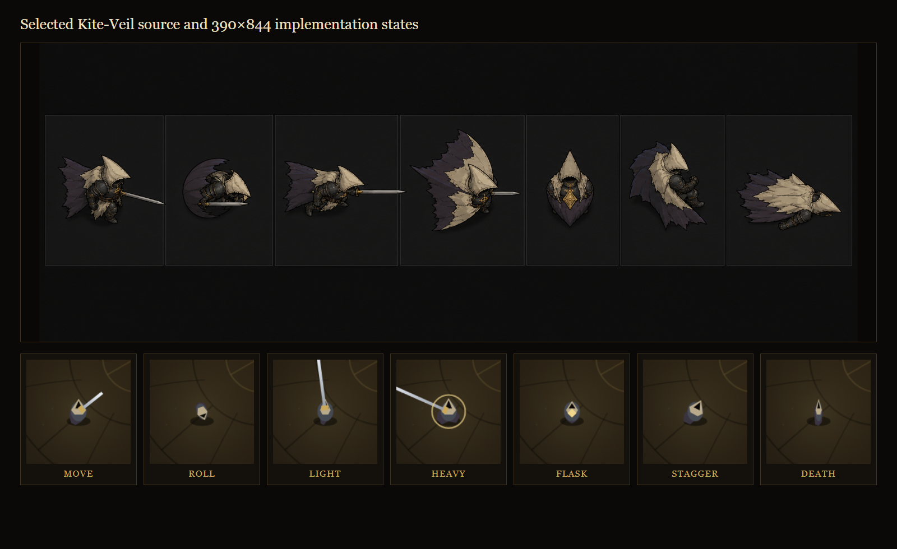
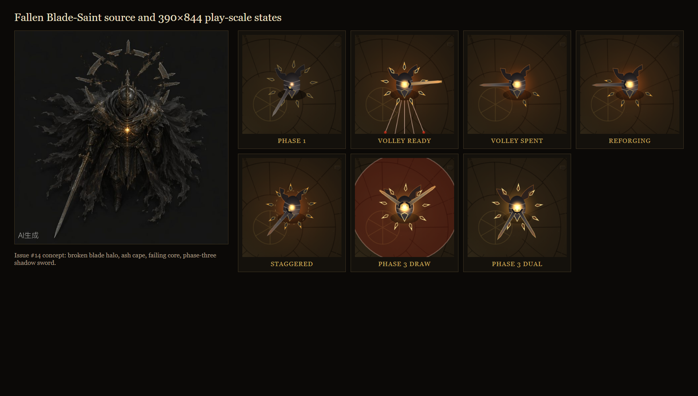

# GRACEFELL v2.11 release record

This is the durable evidence record for the character-readability release called
**“the silhouette is the animation / the halo keeps the score.”** It supplements the
player-facing summary in `README.md`, the detailed reasoning in `DESIGN.md`, and the normalized
visual comparison in `design-qa.md`.

## Release identity

| Field | Value |
|---|---|
| Gameplay/package version | v2.11 / `gracefell@2.11.0` |
| Date | 2026-07-23 |
| Production URL | <https://gracefell.alyoechosys.dev> |
| Pull request | <https://github.com/jonathanwxh-cell/gracefell/pull/17> |
| Merged commit | `846c8a80923afaa1c36d600f412583ff3fd60a7b` |
| GitHub Actions | <https://github.com/jonathanwxh-cell/gracefell/actions/runs/29995604370> |
| Accessibility follow-up | <https://github.com/jonathanwxh-cell/gracefell/pull/18> |
| Follow-up merge | `8e02c3a91f59800bd942cc3e391ad8cb80502488` |
| Follow-up Actions | <https://github.com/jonathanwxh-cell/gracefell/actions/runs/29997701238> |
| GitHub release | <https://github.com/jonathanwxh-cell/gracefell/releases/tag/v2.11.0> |
| Implementer | Codex, GPT-5 / Codex Desktop |
| Design review | Nietzsche, Franklin, Avicenna |
| Boss concept source | Kimi / GitHub issue #14 |
| Directed by | @jonathanwxh-cell |

The production host and public URL were verified at the exact merged revision before the
post-launch user panel began.

## Why this release exists

The earlier player and boss bodies were technically functional but visually radial. At the
authored `0.55` mobile camera zoom, the Penitent is about 19 CSS pixels across; costume trim,
sigils, face shapes, and painterly armor detail collapse into noise. The old circular boss,
outward spikes, and late-phase wings also read as a generic monster rather than a fallen mirror of
the player.

The owner requested a design-house review before implementation. Three independent lanes proposed:

| Lane | Reviewer | Contribution |
|---|---|---|
| Character silhouette | Nietzsche | make the hood the facing contour and keep the body asymmetric |
| Combat UX | Franklin | give all seven player states different large outer masses |
| Technical art | Avicenna | preserve collision/mechanics and use only a few Canvas 2D fills |

The owner selected direction two, the **Kite-Veil** seven-state grammar. Malakar then received the
canonical **Fallen Blade-Saint** direction from GitHub issue #14.

## Shipped Penitent: Kite-Veil

`Player.drawKiteVeilBody()` uses one local coordinate system rotated into facing or roll direction.
The same parchment kite, charcoal torso, and soot-violet veil family changes outer shape by state:

| State | Silhouette |
|---|---|
| Move | arrow with one rear fin |
| Roll | compact notched spindle with the existing spirit afterimage |
| Light | narrow spear profile beneath the established attack ribbon |
| Heavy | broad hammerhead during charge, narrow release profile |
| Flask | closed seed with one grace-gold seal |
| Stagger | unarmed broken hood/veil angle |
| Death | flattened leaf with no sword or gold |

The resting sword is hidden during roll, flask, stagger, and death so it cannot erase those verbs.
Collision remains `r=15`. Input timing, stamina, damage, iframes, audio, HUD, and camera are
unchanged.



## Shipped Malakar: Fallen Blade-Saint

The old radial body/crown is replaced on the default route:

- a narrow facing-led armor ellipse and pointed helm inside the unchanged `r=34` hit circle;
- a split translucent ash cape from phase one;
- nine broken sword fragments as a diegetic halo;
- a smaller failing amber saint-light instead of the old oversized fireball core;
- a long pointed coatsword with a swept guard;
- amber halo tips in phase two;
- a mirrored shadow coatsword drawn over `0.4 s` in phase three.

The halo is persistent state rather than a one-frame effect. Volley spends five blades in phase
one, seven in phase two, and nine in phase three. One fragment reforges every `0.8 s`. During
poise stagger the orbit slows to `0.22` and each blade receives independent radius wobble. Health,
damage, movement, attack selection, cooldowns, projectile counts/speeds, rings, meteors, poise,
and all seven authored windups are unchanged.



## Performance and asset boundary

Both characters remain procedural Canvas 2D. No sprite sheet, texture, model, new render surface,
or runtime network request was added. The committed PNGs above are documentation evidence only and
are excluded from Vite's production bundle.

The deterministic capture harness measured median phase-three render submission below `0.4 ms` on
both `390×844 @2x` mobile and `1280×800 @1x` desktop contexts, against a `16.7 ms` 60 Hz frame
budget. Percentage comparisons at sub-millisecond scale are too noisy to be meaningful, so the
contract is absolute budget plus the complete gameplay gate.

## Automated acceptance

The local release candidate passed:

```text
npm run lint  PASS
npm run build PASS
npm run qa    PASS, zero errors
git diff --check PASS
```

The accepted full run measured first-gesture audio initialization at `14.9 ms` desktop,
`12.0 ms` mobile, and `13.8 ms` in the separate cold first-tap lane. Three preceding full runs
passed every gameplay, graphics, Blade-Saint, difficulty, resurrection, and layout assertion but
hit the existing strict timing guards at `30.6 ms` desktop, `20.2 ms` mobile, and `28.5 ms`
desktop respectively. Those transient measurements are preserved here rather than hidden; no audio
code changed in v2.11 and the final full run passed without weakening the budgets.

The built `dist/` contains zero raster images. The two committed comparison boards total about
`1.1 MB` under `docs/` and do not enter the `5.24 MB` production output.

The established gate still covers desktop, non-touch mobile, real-touch mobile, title/intro/fight,
all player verbs, every boss attack and phase, difficulty immutability, hit-stop buffering,
30/60/120 Hz motion, audio routing/timing/pressure, collision behavior, terminal trade policy,
touch and pointer-only resurrection, accessibility semantics, persistence, and hazard-hue
discipline.

New Blade-Saint assertions prove:

- phase-two volley spawns seven projectiles and spends seven halo blades;
- no blade returns before `0.8 s`, then exactly one returns across that boundary;
- the phase-three shadow sword is 50% drawn at `0.2 s` and complete at `0.4 s`;
- the boss hit radius remains 34.

The design capture matrix adds:

- all seven Kite-Veil player states at `390×844 @2x` and `1280×800 @1x`;
- Blade-Saint phase one, volley-ready, volley-spent, partial-reforge, stagger, partial shadow-sword
  draw, and complete dual-sword states at both targets;
- same-image source/implementation comparisons;
- full-scene screenshots and zero browser/page errors.

The same contract then ran across the release path:

| Environment | Revision | Result |
|---|---|---|
| Local isolated server | `f2383f7` release commit | PASS, zero errors |
| GitHub Actions `playtest` | `f2383f7` PR head | PASS in 1m40s |
| Public production rerun | `846c8a8` merged main | PASS, zero errors |
| Local accessibility follow-up | `95b08ec` follow-up commit | PASS, zero errors |
| GitHub Actions `playtest` | `95b08ec` PR #18 head | PASS in 1m21s |
| Public follow-up rerun | `8e02c3a` merged main | PASS, zero errors |

The accepted production run measured audio initialization at `13.4 ms` desktop, `12.8 ms`
mobile, and `16.1 ms` in the separate cold first-tap lane.

The accepted follow-up production run measured `15.2 ms` desktop, `15.5 ms` mobile, and `14.5 ms`
in the cold first-tap lane. Its semantic Start assertion reported `paused=false`,
`uiFocused=false`, canvas focus present, and an active animation frame loop. Touch resurrection
also returned `dead → intro` and advanced the attempt counter.

## Changed from v2.10.1

- Default player rendering changes to the seven-state Kite-Veil silhouette system.
- Default boss rendering changes to the Fallen Blade-Saint.
- Three boss visual-state fields track halo depletion/reforge and shadow-sword draw.
- QA, README, project facts, design reasoning, contributor provenance, and visual evidence expand
  to cover both characters.
- Combat balance, save schema, controls, difficulty, music, SFX, arena rendering, and runtime asset
  count do not change.

## GitHub issue disposition

- #10 closed as implemented by the selected Kite-Veil Penitent.
- #14 closed as implemented by the Fallen Blade-Saint.
- Player alternatives #11/#12 and boss alternatives #13/#15 closed as not planned, with comments
  linking the shipped directions, PR #17, and this release record.
- Open issue count after publication: zero.

## Production deployment

The host checkout at `/home/alyosha/apps/gracefell` was clean on v2.10.1
(`a528153a2a051d256f06e9f3fcc20a941cb63ea4`). It was first fast-forwarded to release merge
`846c8a80923afaa1c36d600f412583ff3fd60a7b`. After the live user panel, PR #18 passed GitHub
Actions and was merged as `8e02c3a91f59800bd942cc3e391ad8cb80502488`. The same checkout was
fast-forwarded to that exact follow-up merge, built as `gracefell@2.11.0`, and restarted through
the user-level `gracefell.service`.

Deployment acceptance:

- remote `git rev-parse HEAD`: `8e02c3a91f59800bd942cc3e391ad8cb80502488`;
- remote worktree: clean `main...origin/main`;
- service: active, Node process listening on `127.0.0.1:8491`, about `14.5 MB` at readback;
- local service `/health`: `{"ok":true,"app":"gracefell"}`;
- public `/health`: HTTP 200 with the same body;
- public home: HTTP 200, serving `assets/index-2Yg1zfoK.js`;
- complete public Playwright gate: PASS, zero errors, including semantic Start focus handoff and
  touch resurrection.

## Known limits

- Headless Chromium verifies rendering state and timing, not subjective controller feel.
- Real iOS Safari URL-bar/dynamic-viewport behavior still needs physical-device confirmation.
- Haptic requests are verified, but physical vibration cannot be assessed headlessly.
- The procedural translation preserves silhouette and state grammar rather than the source
  paintings' micro-detail; that detail would not survive the mobile camera.

## Post-launch user panel

Three independent user personas tested the public site only after revision `846c8a8` was live:

| Persona | Surface | Result |
|---|---|---|
| Mobile touch player | iPhone-class `390×844`, DPR 3, coarse pointer | Complete production QA and the title, joystick, all four combat verbs, settings persistence, death, and touch resurrection passed with zero errors |
| Desktop Souls veteran | `1280×800`, keyboard | Movement, roll/perfect dodge, light/heavy differentiation, flask recovery, and boss telegraphs passed with no Gracefell-origin console errors |
| New player/accessibility user | desktop keyboard plus true-touch iPhone emulation | Touch path passed; semantic desktop Start exposed one release-blocking focus trap |

The accessibility reproduction was exact: reveal the semantic companion panel, focus **Start
fight**, and press Enter. When the intro advanced, the now-disabled button retained UI focus, so
the fight stayed paused with no visible pause explanation. `Home.confirmFromUi()` now completes
the requested confirmation, clears `uiFocused`, and explicitly returns focus to the game canvas.
The desktop gate starts through that same button and requires the fight to be unpaused, UI focus
to be clear, the canvas to own document focus, and the animation frame loop to be running.

After the fix, lint and build passed and the complete local QA gate passed with zero errors.
Accepted audio initialization measured `12.6 ms` desktop, `12.8 ms` mobile, and `11.2 ms` in the
separate cold first-tap lane. Four immediately preceding runs passed the focus regression and all
gameplay assertions but crossed the deliberately strict synthetic audio guards by `0.3–6.8 ms`
under accumulated browser load. The completed persona browser processes were closed, the same
unchanged thresholds were rerun, and the full gate passed. No audio budget was weakened.

The panel also identified useful non-blocking polish for a future release:

- player verbs and the boss body can mask one another at very close range on a phone;
- phase-one versus phase-two boss contrast is modest compared with the clear phase-three second
  sword and halo changes;
- flask completion could use a short health-bar arrival pulse;
- the visible trial selector could explain its easier/harder direction;
- the death retry copy can become too dim at the trough of its pulse.

These do not alter the v2.11 acceptance decision. The semantic Start defect was the only blocker
found in the bounded post-launch panel, and it is covered by an automated regression before the
final production follow-up.

PR #18 passed the complete GitHub Actions playtest, merged as `8e02c3a`, and was deployed and
retested publicly with zero errors. GitHub release `v2.11.0` targets that verified follow-up merge.

The desktop persona also reported damage after switching tabs. The engine already pauses on both
`blur` and `visibilitychange`, and the automated interruption regression confirms simulation and
audio remain suspended after interruption. A second headless multi-tab probe was inconclusive in
the Windows browser surface, so this record does not claim a physical-browser tab-switch result;
that remains a bounded manual follow-up rather than an unverified release claim.
