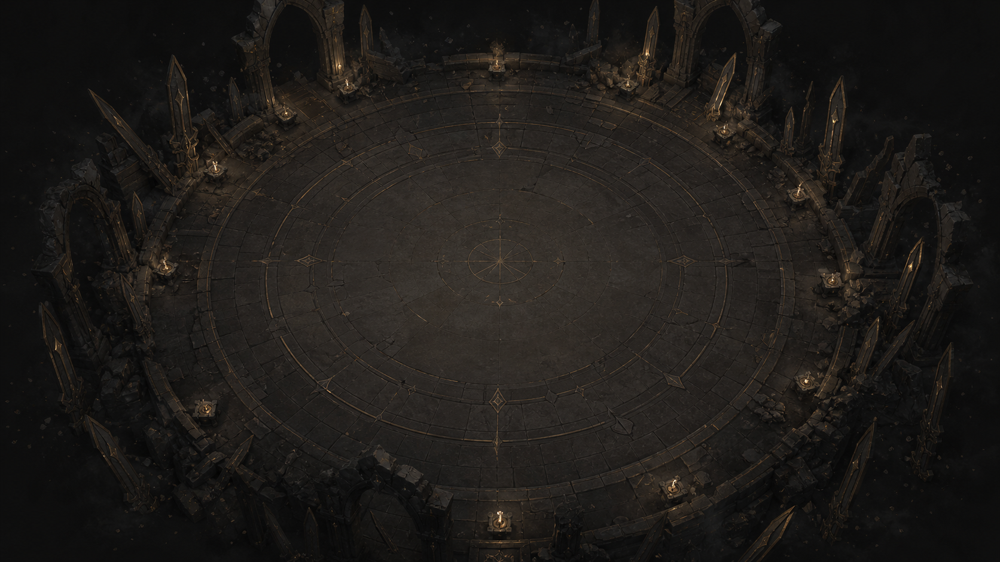
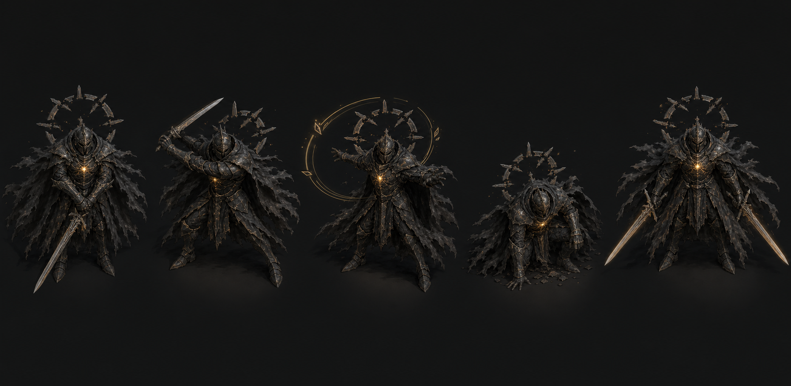
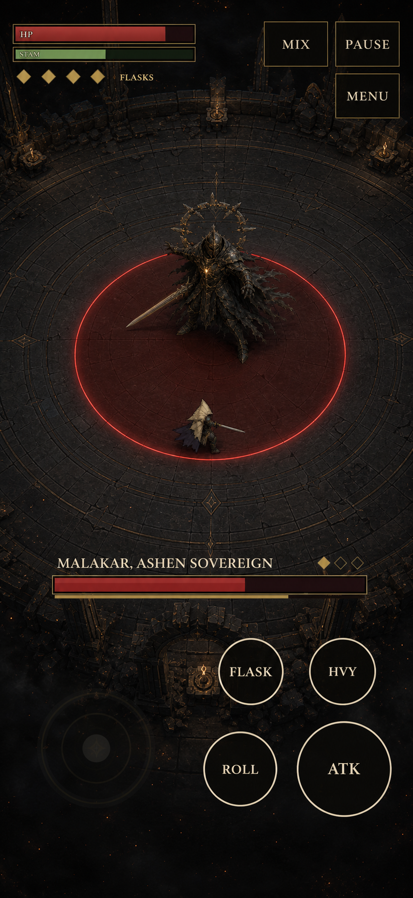

# Gracefell Blender-Assisted 2.5D Visual Upgrade Specification

Status: implemented and under v2.25 release acceptance
Implementation baseline: v2.24 candidate `8a208bc` on 2026-07-26
Primary direction: Blender-authored, Canvas-first 2.5D
Optional direction: query-gated vanilla Three.js proof only after the Canvas proof passes

## Decision

Gracefell should use Blender as an art-authoring tool without immediately replacing
its Canvas2D combat renderer.

The implemented first release candidate is one baked, near-top-down arena plate
that replaces the current cached procedural floor. Telegraphs, hazards, weather, characters,
collision, timing, difficulty, score, audio, save data, input, and the HUD remain
authoritative in the existing engine.

The second proof is Malakar only. Compare:

1. the current procedural boss;
2. a tightly bounded Blender-to-Canvas boss treatment;
3. a live low-poly GLB rendered through vanilla Three.js.

Three.js remains an optional enhanced-renderer proof unless it becomes clearer
and measurably stable on real phones. A full engine conversion is not approved by
this specification.

## Concept boards

These images are visual targets, not production assets. They are intentionally
larger and more detailed than the runtime budgets in this document. Do not copy
them into `public/` or ship them as game textures.

### Ashen Reliquary arena



Target qualities:

- a quiet, low-contrast centre for combat;
- recognisable Gothic silhouette at the perimeter;
- broad charcoal, bronze, parchment, and soot-violet material groups;
- depth from rim structures, baked contact shadows, and a restrained emissive path;
- no decorative red inside the combat field;
- no tall foreground occluder that could cover a body, boss tell, hazard, or dodge route.

### Malakar five-pose target



This board specifies silhouette and state change, not final polygon density. The
five proof states are:

1. phase-one guard;
2. swipe anticipation and release;
3. ring-cast anticipation;
4. stagger;
5. phase-three dual-sword reveal.

### Native mobile composition target



This board is a composition target. It shows the intended depth hierarchy,
protected HUD zones, exact ring visibility, and separation between the boss bar
and touch controls. It is not a pixel-perfect replacement for the current HUD.

## Goals

- Improve perceived model quality and world depth at Gracefell's real play scale.
- Make Malakar's phase and action silhouettes easier to read.
- Preserve the instant clarity of the existing combat signals.
- Remain smooth on mobile Safari and modest Android hardware.
- Keep every step measurable, reversible, and available behind a proof flag.
- Add no gameplay, difficulty, persistence, scoring, audio, or input change.

## Non-goals

- No free camera, perspective camera, camera orbit, or gameplay verticality.
- No physics-engine migration and no Rapier dependency.
- No dynamic mobile shadows, screen-space post-processing, or translucent fog
  surface over combat signals.
- No complete pre-rendered directional animation library for every actor.
- No default Three.js renderer before physical-device validation.
- No redesign of the title screen, controls, or save schema in this visual pass.

## Current-engine constraints

- `Game` in `src/game/engine.ts` owns one Canvas2D context, the simulation loop,
  entities, effects, weather, telegraphs, and UI timing.
- `buildFloor()` constructs a cached arena surface. The baked plate must replace
  that allocation and draw path rather than add a second full-size surface.
- Boss telegraphs use simulation geometry. Their shape, radius, angle, duration,
  and safe area must not be inferred from an animation.
- Weather already has an intentional depth order. The upgrade must preserve that
  order and keep high-opacity weather away from attack windups.
- At the authored mobile zoom, the player can be about 19 CSS pixels tall.
  Silhouette, pose, contrast, and movement therefore matter more than small
  costume detail.
- `window.__game`, semantic controls, `touchLayout()`, save migrations, and the
  existing QA selectors remain compatible.

## Art direction

### Visual hierarchy

At native size the image should read in this order:

1. lethal telegraph or safe route;
2. player and boss silhouettes;
3. health, stamina, boss state, and touch controls;
4. combat impacts and weather;
5. arena ornament.

If an asset reverses that hierarchy, simplify or darken it.

### Shape language

- Player: compact, bright blade, clear facing direction, minimal trailing cloth.
- Malakar: roughly twice the player's visual mass, broad shoulders, long cape
  wedge, visible amber chest core, and halo fragments that communicate state.
- Arena: circles, radial fractures, arches, buttresses, and offset ruins. The
  centre remains broad and calm.
- Phase changes: alter large contours, value balance, and motion direction before
  adding particles or texture noise.

### Colour language

- Base: charcoal black and smoke brown.
- Structure: aged bronze and muted gold.
- Grace: warm parchment and pale ivory.
- Corruption: restrained soot violet.
- Danger: the existing attack-warning red, reserved for gameplay signals.
- Safe or recoverable state: pale gold or neutral ivory; never a competing red.

## Arena asset specification

### Camera and composition

- Blender camera: orthographic, near-top-down, fixed to the gameplay axis.
- Match the current circular combat boundary and world-to-screen centre.
- Keep the central 65% of the circle free of tall or high-contrast ornament.
- Confine silhouette-rich ruins to the outer ring and corners.
- Do not bake a player, boss, attack telegraph, weather particle, UI, vignette,
  chromatic aberration, or camera shake into the plate.

### Bake

- Author at `2048 × 2048`; use a square transparent or opaque output according to
  the replacement path chosen in the proof.
- Bake soft global illumination, ambient occlusion, broad contact shadows, and
  restrained emissive markings.
- Avoid small normal-map-like noise that disappears at mobile scale.
- Keep phase-neutral lighting in the base. Runtime phase tint and weather remain
  procedural.
- Export a lossless review PNG, then create an optimised WebP or AVIF runtime
  candidate.

### Runtime budget

- Base arena transfer: at most `700 KB`.
- Combined phase overlays: at most `400 KB`.
- One decoded `2048 × 2048` RGBA surface is about `16 MiB`; do not retain both a
  same-size procedural floor and baked floor after the asset is ready.
- Render-probe increase: at most `0.5 ms` p95 against the current cached-floor
  baseline.
- Decode happens before battle confirmation or during an idle title interval.
  No first-action decode or upload hitch is acceptable.

### Phase overlays

Optional phase overlays are masks, not complete second arenas:

- phase two: warmer radial seams and sparse ember vents;
- phase three: cooler grace fractures and altered perimeter silhouette emphasis.

Use at most `1024 × 1024` per mask. Stamp or composite them into the existing
cached/scorch surface at a phase transition; do not add a permanent full-screen
blend pass.

## Protected mobile layout

Validate first at `390 × 844` CSS pixels and at the game's real camera scale.

- Top-left: HP, stamina, flasks, and short combat status.
- Top-right: mix, pause, sound, and menu utilities.
- Centre: uninterrupted boss/player/telegraph field.
- Above lower controls: boss name, phase state, poise, and boss health.
- Lower-left: movement touch region.
- Lower-right: flask, heavy, roll, and attack touch regions.
- No baked ruin, halo, weather streak, or effect may masquerade as a button edge
  or pass beneath a label with enough contrast to reduce readability.
- The complete telegraph edge and intended safe route remain visible outside the
  control discs.

The mobile board above is the layout reference for this protection, while the
current semantic HTML and exact touch geometry remain authoritative.

## Malakar proof specification

### Readability targets

- The action must be identifiable from silhouette before impact VFX begins.
- The amber core stays visible in all five proof poses.
- Cape motion supports facing and momentum; it never covers the blade path or
  ring boundary.
- The nine halo fragments remain an honest indicator of boss state. If modelled,
  their transforms still come from the current gameplay state.
- The phase-three reveal must change the large silhouette for at least one clear
  beat before normal action cadence resumes.
- Stagger collapses the upper-body triangle and halo alignment without changing
  the gameplay root or hitbox.

### Comparison packet

Record the same deterministic combat state in all three treatments:

- same camera, scale, state seed, pose times, weather profile, and HUD;
- one still and one short capture for each of the five states;
- native `390 × 844` and `1280 × 800` captures;
- greyscale and silhouette-only review versions;
- frame-time and transfer receipts for each candidate.

Reviewers score action recognition, safe-route recognition, silhouette quality,
visual hierarchy, and perceived quality. The 3D candidate does not win on
novelty; it must win without losing clarity or performance.

## Character asset pipeline if a future live GLB wins

Player remains procedural through the arena and Malakar proofs. If the live
renderer passes, use these initial limits:

| Asset | Triangles | Bones | Materials | Texture |
| --- | ---: | ---: | ---: | ---: |
| Player | 6k–10k | at most 35 | 1–2 | one 1024 atlas |
| Malakar | 12k–18k | at most 45 | 1–2 | one 1024 atlas |
| Halo fragments | shared mesh, instanced | 0 | 1 | shared |

- Blender source uses Y-up authoring conventions with the origin at ground
  contact and a documented export transform.
- Use opaque or alpha-tested cape geometry; avoid order-dependent blended cloth.
- Use no root motion. The simulation remains the source of position, facing,
  collision, attack window, and invulnerability.
- Quantise and compress the final GLB. Use KTX2/Basis textures if the proof
  demonstrates meaningful transfer or memory benefit.
- Do not duplicate materials per limb, blade, or halo fragment.

Minimum animation clips:

- Player: idle/move, roll, light 1/2/3, heavy charge/release, roll slash, flask,
  stagger, death.
- Malakar: spawn/stalk, swipe, slam, charge, volley, meteor, ring, spiral,
  stagger, death, phase-three reveal.

Animation events never decide damage. The engine provides a render snapshot and
the presentation samples the correct pose from authoritative state.

## Telegraph, VFX, and weather invariants

- Draw telegraphs in a dedicated signal pass above arena art and below bodies only
  where existing occlusion rules require it.
- Preserve the exact current geometric radii, cones, lanes, rings, safe sectors,
  fill progression, and timing.
- A hard warning boundary stays crisp. Bloom, distortion, and particles may
  accent it but never replace it.
- Release and impact VFX begin after the decision window, not during the earliest
  readable windup.
- Weather keeps three depth bands. During dangerous windups, the high-opacity
  foreground density over the central field is zero.
- Screen shake and flashes still respect the current comfort settings.
- Decorative light never uses the same saturation, cadence, or edge shape as a
  lethal warning.

## Runtime architecture

### Stage A — baked Canvas arena (accepted)

- Load the optimised arena image asynchronously.
- Keep the current procedural `buildFloor()` output as a fallback for decode,
  network, compatibility, or memory failure.
- Draw the arena into the existing cached floor surface, then apply current
  scorch, weather, telegraph, entity, effect, and UI passes in their current
  order.
- The accepted release default is `arena-bake`; `?visual=procedural` remains the
  explicit comparison and automatic failure fallback. Do not persist either
  query choice.
- Do not add Three.js or a second render context.

### Stage B — Malakar comparison (completed)

- `?boss=current`: current procedural treatment.
- `?boss=blender-canvas`: bounded baked/vector treatment in Canvas.
- `?boss=blender-three`: live GLB proof.
- The flags are developer/review flags and must not enter the save payload.
- The test harness must be able to force the same pose and state for all three.

### Stage C — optional enhanced renderer (rejected for production)

If and only if the live candidate passes:

- use vanilla Three.js as an adapter owned by the existing engine loop;
- define a pure `RenderSnapshot` containing actor transforms, animation state,
  phase, telegraph geometry, weather profile, camera response, and presentation
  events;
- map gameplay `x/y` to render `x/z`;
- use a fixed orthographic camera and transparent WebGL layer;
- keep the current Canvas/DOM overlay for telegraphs and HUD initially;
- retain `Classic` Canvas as a supported fallback;
- select the renderer at title or pause, never in the middle of a fight;
- explicitly update QA selectors before a second canvas is added.

The renderer may interpolate transforms. It may not mutate gameplay state or own
damage, collision, cooldown, score, difficulty, or save data.

## Proposed file layout

```text
art/
  blender/
    source/
      ashen-reliquary.blend
      malakar.blend
    review-renders/
public/
  art/
    arena/
      arena-base.webp
      phase-2-mask.webp
      phase-3-mask.webp
    models/
      malakar.glb
scripts/
  art/
    optimize-gltf.mjs
docs/
  visual-upgrade/
    BLENDER_2_5D_VISUAL_SPEC.md
    assets/
```

Only optimised runtime assets belong in `public/`. Decide and document Git LFS
policy before committing large `.blend` sources. Never silently place source
textures, review renders, or raw GLBs in the runtime tree.

## Performance gates

### Baked Canvas candidate

| Gate | Limit |
| --- | ---: |
| Arena transfer | at most 700 KB |
| Phase overlays combined | at most 400 KB |
| New permanent full-size surfaces | 0 |
| Existing render-probe p95 increase | at most 0.5 ms |
| Combat or save changes | 0 |

### Live Three.js candidate

| Gate | Limit |
| --- | ---: |
| Mobile device-pixel ratio | 1.0–1.25 |
| Total visible triangles | at most 80k |
| Draw calls | at most 45 |
| Estimated GPU texture memory | at most 48 MiB |
| Initial 3D transfer | at most 3 MB |
| Total 3D transfer | at most 5 MB |
| Ten-minute physical-phone p95 | at most 20 ms |
| Ten-minute physical-phone p99 | at most 33 ms |
| Context loss | 0 |
| Input regression or thermal degradation | 0 |

The three concept PNGs in this folder are documentation assets and intentionally
do not satisfy runtime transfer budgets.

## QA protocol

### Static and native-size review

- Capture `390 × 844`, `430 × 932`, and `1280 × 800`.
- Inspect at 100% size, not only enlarged.
- Run colour, greyscale, silhouette, and contrast reviews.
- Check every boss telegraph against both quiet and severe weather.
- Check that HP, stamina, boss bar, labels, and touch controls have no visual
  collision with art or effects.

### Deterministic parity

- Run identical seeds at 30, 60, and 120 Hz.
- Compare position, health, stamina, boss health, boss phase, boss action,
  attack window, score, and victory/death results.
- Require no gameplay-value change between renderers.
- Run the existing `npm run qa` gate without weakening selectors or expectations.

### Playtest

- At least five first-time or novice players and five experienced action players.
- Target at least 90% recognition of the sampled boss action before impact.
- Target at least 80% correct identification of the intended dodge direction.
- No decrease in completion, resurrection, pause/resume, or battle-menu success.
- Record subjective depth and quality separately from mechanical clarity.

### Physical-device soak

- At least one recent iPhone, one older iPhone, and one mid-range Android.
- Ten minutes of continuous phase-three combat or equivalent stress.
- Record p50/p95/p99 frame time, memory trend, thermal throttling, first-action
  hitch, input latency, and WebGL context loss.
- A first-action decode or upload hitch over `50 ms` fails the candidate.

## Rollout gates

1. **Specification approval:** confirm the art direction and budgets in this file.
2. **Arena proof:** implement only the baked arena behind a query flag; accept it
   only if native-size clarity and the Canvas performance gate pass.
3. **Malakar proof:** produce and measure the three-way comparison packet.
4. **Renderer decision:** keep Canvas unless live Three.js clearly wins on both
   visual scores and physical-device gates.
5. **Release:** only after local QA, exact-SHA deployment, live replay, and a
   dated release note. Remove unused candidate assets and dependencies.

The implementation followed these gates in order. The Three proof was retained
for explicit development comparison, but failed the renderer-decision gate:
native-size player review preferred the Canvas silhouette and no physical-phone
soak exists to justify WebGL as a production default.

## Acceptance checklist

- [x] Arena centre remains visually quiet at native mobile size.
- [x] Every telegraph edge and safe route stays legible.
- [x] Malakar's five Canvas proof poses are distinguishable in silhouette.
- [x] Halo fragments remain honest gameplay state.
- [x] No gameplay, difficulty, input, audio, score, or save value changes.
- [x] Runtime candidates meet transfer and automated draw-call/frame budgets.
- [x] Classic Canvas fallback works after an asset or WebGL failure.
- [x] Existing desktop/mobile/true-touch Chromium QA remains green.
- [ ] Physical-phone soak passes before any enhanced renderer becomes default.
- [x] Production assets, source assets, credits, and optimisation steps are
      documented in the release handoff.

## Provenance and research basis

The existing Kimi/Codex character comparison material and a real mobile capture
were used as visual references. Codex generated the three new boards in this
folder on 2026-07-26 with the built-in image-generation workflow. These new
boards must not be attributed to Kimi and are not runtime assets.

The staged approach follows the broad production patterns described in:

- [Blender Manual: Baking](https://docs.blender.org/manual/en/latest/render/cycles/baking.html)
- [Three.js Manual: Responsive design](https://threejs.org/manual/#en/responsive)
- [Three.js Manual: Cleanup](https://threejs.org/manual/#en/cleanup)
- [MDN: WebGL best practices](https://developer.mozilla.org/en-US/docs/Web/API/WebGL_API/WebGL_best_practices)
- [Supergiant Games: Developing Hell #01](https://www.supergiantgames.com/blog/developing-hell-01/)

These references support the workflow; Gracefell's own native-size playtests and
performance gates decide what ships.
